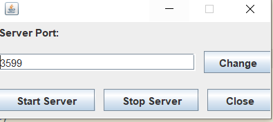
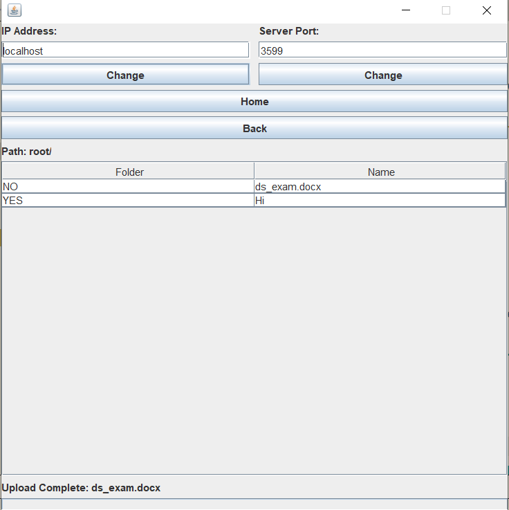
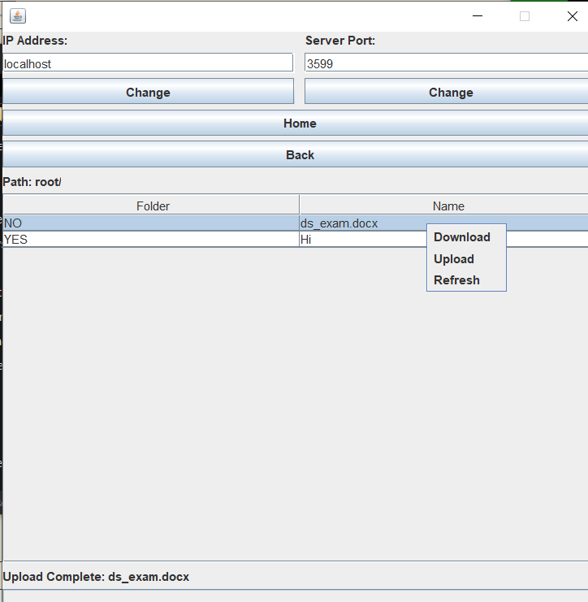
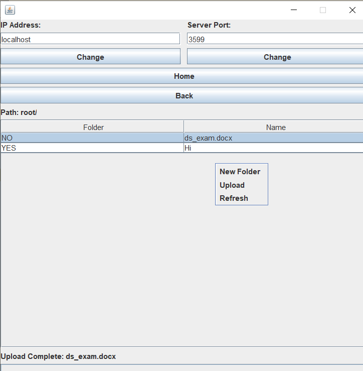

# File Server System
File server system has developed using Socket Programming which includes Client and Server application.Used java and swing (for UI) to build this.

## How To Run
Required JDK Version: 8  
Open the project using a java IDE (Preferably Intellij IDEA) . Setup SDK (Java version 8) and build the project. Run the ServerUI.java main method (src/fileserver/ui/ServerUI.java) first to run the Server application and then ClientUI.java main method (src/fileserver/ui/ClientUI.java) to run the Client application.  
After the Server application starts use the `Start Server` and `Stop Server` button to start and stop the server at the specified port. Port 3599 is set for both Server and Client by default which can be changed in both Server and Client. After Starting the server click the `Home` button in the Client application to load the Root Directory folder and file list when the server is running on the local computer. For servers running on remote computer we have to specify the correct IP address of the Server along with the correct port in the Client application. Now we can navigate the file server using the Client application and use its various features.  We use the `Stop Server` button to successfully stop the server and `Close` button to close the Server application.

## Features
### Base Features:
* After Starting the Server application, the server can be started at port 3599 (by default) by clicking the `Start Server` button. This will initialize the required communication setup so that clients can join the system.
* After Starting the Client application, options for changing the IP address and port number of the server is available. The Server application also provides option to change the port of the server.
* The Client application provides a GUI interface with directory service capable of showing available directories and files in the server.
* Files can be uploaded to the server using the context-menu (a right-click mouse operation) in the Client application.
* Files can be downloaded the server using the context-menu (a right-click mouse operation on a file) in the Client application.

### Other Features
* Navigate to the Root Directory of the server using the `Home` button.
* Open folders using the context-menu or double clicking the folder.
* Create a new folder using the `New Folder` button in the context-menu.
* Refresh the contents of the directory using the `Refresh` button in the context-menu.
* Return to the parent directory using the `Back` button or using the context-menu.
* Shows status of Downloading or Uploading file from the server.

## Developed by
**Group 15**

* Md. Mazharul Islam - 2017831039

## Screenshot
### Server
 

### Client

##Download Option

##Upload Option
